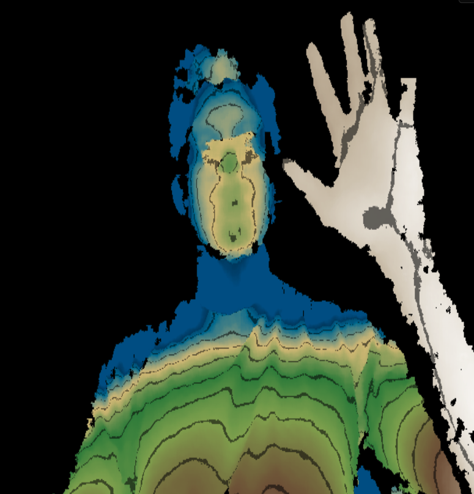

# Terrain Lab

[**Open the live Terrain Lab →**](https://msriram.github.io/terrain-lab/)



A Mac-first Kinect-powered augmented-reality sandbox inspired by
[Magic-Sand](https://github.com/thomwolf/Magic-Sand) and
[DuneBox](https://github.com/Manaiakalani/DuneBox). A small native depth bridge
feeds a dependency-free browser display.

## Run it

On this macOS Kinect-v1 setup:

```bash
./scripts/run.sh
```

The launcher prints the URL to open. It builds the small native capture bridge
when needed and starts the browser application. Close TouchDesigner first so
the Kinect is available to the app.

The interface is also hosted at
[msriram.github.io/terrain-lab](https://msriram.github.io/terrain-lab/). On a
Mac with the Kinect, first
run `./scripts/run.sh`, open the hosted page, and press **Connect Kinect**. The
hosted interface discovers the local bridge; the depth data never leaves the
machine. Projection remains disabled until a live sensor is connected.

### Reliable Kinect service on macOS

For a fixed sandbox machine, run this once after cloning the repository:

```bash
./scripts/install-kinect-service.sh
```

It installs a per-user background service which starts at login, waits idle
without holding the Kinect, starts capture when **Connect Kinect** is pressed,
releases the USB device on **Disconnect**, and retries a failed capture. For a
portable one-off session, double-click `Open Terrain Lab.command` instead.

If port 8080 is already occupied, the launcher automatically tries 8081 through
8099 and prints the selected address. To request a specific port, run
`PORT=9000 ./scripts/run.sh`.

Controls:

- Choose from 20 color worlds in the in-scene control panel.
- Press **Auto fit** to map the visible surface to the full color range.
- Move **Position** to shift the color band nearer/farther and adjust **Range**
  for shallow or deep terrain. The minimum 150 mm span avoids noisy extremes.
- Use **Color spread** for palette contrast and **Stability** to reduce flicker.
- Toggle contour lines and the simulated water level.
- Press **Reset terrain** to restore the sample landscape.
- Keep this controller window on the laptop. Use **Open projector window** (or
  press **F**) to create a separate clean projection window, drag that window
  to the projector display, then press **F** there for browser fullscreen.
- The Kinect normally sees a wider area than the projector. During
  **Calibrate**, select the four inside corners of the sandbox in the laptop
  preview; Terrain Lab crops and stretches that camera region to fill the
  projector window.

No package manager, build step, account, or network access is required after
the repository is downloaded.

## Open the Kinect viewer

With TouchDesigner, FreenectTD, and the Kinect connected, double-click
`Open Kinect Viewer.command` in Finder. It opens the bundled ready-made
FreenectTD example at `touchdesigner/Kinect Viewer.toe`; no node construction
is required.

Prerequisites:

```bash
brew install libfreenect
```

## What works now

- Live Kinect v1 depth capture on Apple-silicon macOS
- Full native 640×480 depth processing with 1024×768 projector output
- Synthetic height/depth fallback
- Twenty authored color themes
- Contour lines
- Water-level visualization
- Separate laptop controller/live-preview and fullscreen projector windows
- Adjustable depth position, range, contrast, smoothing, and automatic fitting
- Saved four-corner sandbox ROI calibration with alignment-grid preview
- Responsive UI for ordinary laptop screens

## Remaining physical-rig work

Live depth and four-corner sandbox-region capture are implemented. Automatic
camera/projector correspondence, reference-plane fitting, and water-flow physics
remain future milestones. Use Projector view for a clean fullscreen output and
adjust the depth band for the current mounting height.

## Repository layout

```text
app.js                 browser renderer and interaction
index.html             application shell
styles.css             responsive presentation
control-icon.css        compact collapsed-control affordance
native/kinect_depth_bridge.c native Kinect v1 capture helper
scripts/kinect_server.py local static/depth server
scripts/run.sh         build-and-run launcher
scripts/check-kinect.sh verify Kinect USB and FreenectTD setup on macOS
scripts/install-kinect-service.sh install the managed macOS background bridge
Open Terrain Lab.command one-click portable launcher
Open Kinect Viewer.command double-click launcher for the Kinect viewer
touchdesigner/Kinect Viewer.toe ready-made FreenectTD viewer project
docs/PLAN.md           research, architecture, and milestones
docs/KINECT_MAC_SETUP.md Kinect v1 setup and DuneBox integration path
upstream-magic-sand/   unmodified upstream reference checkout
```

## GitHub readiness

The local `upstream-magic-sand` reference checkout is excluded from publishing.
Magic-Sand is GPL-2.0 licensed and remains an upstream design reference. A final
license should be chosen for the original Terrain Lab code before release.
